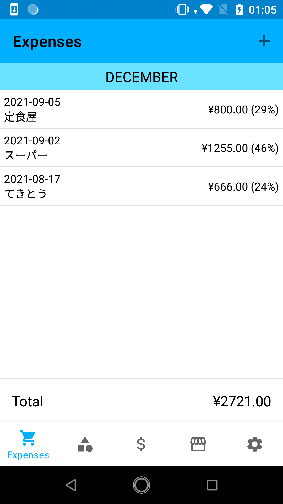
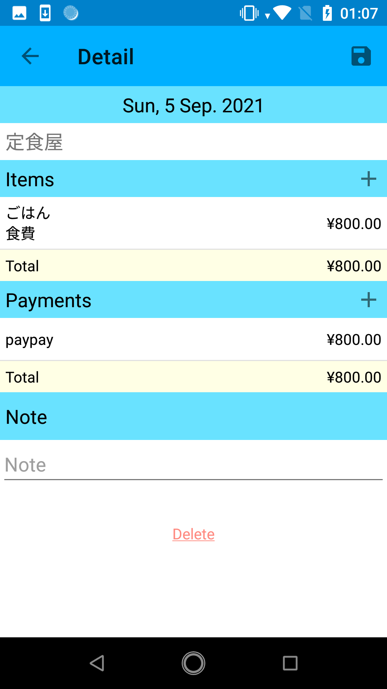
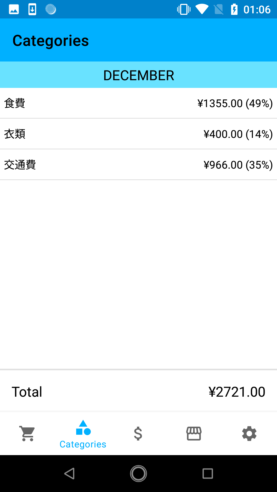
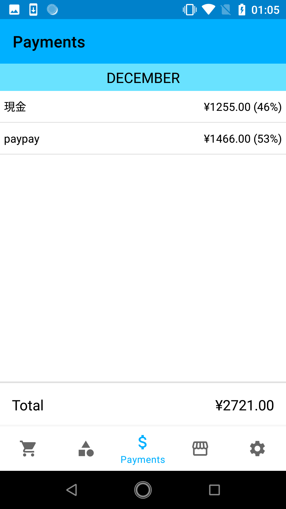
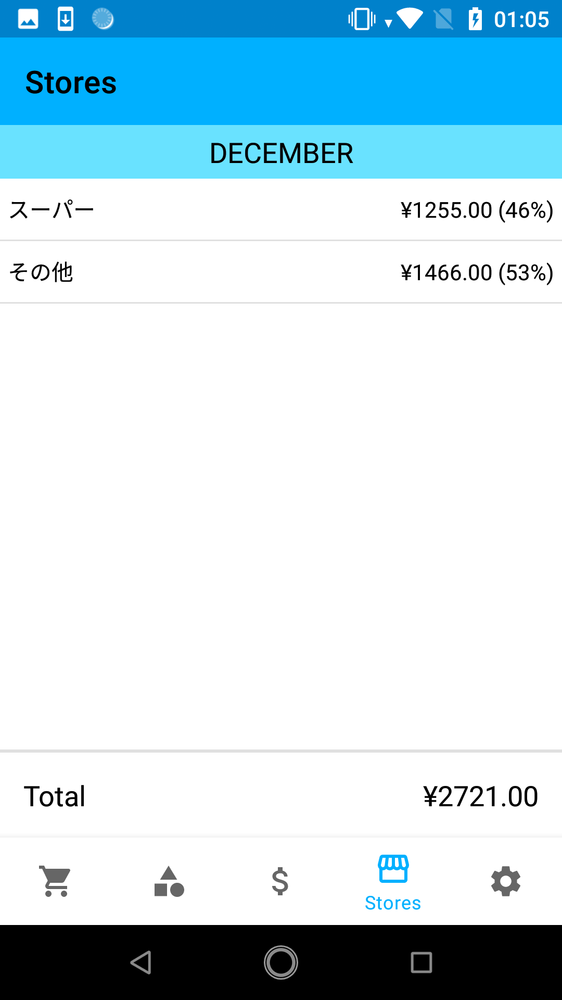
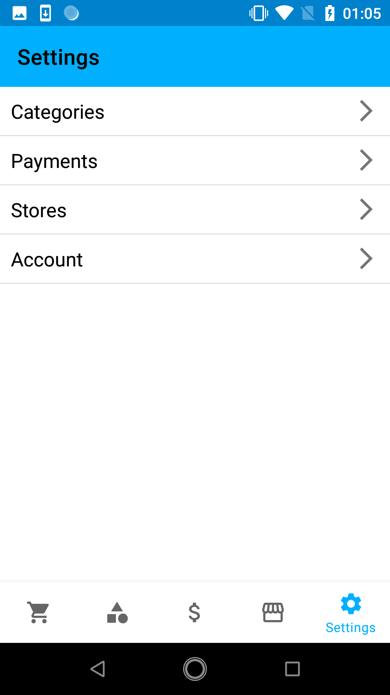

# My money

## コンセプト

私の、私による、私のための家計簿アプリ
訳: 自分がほしい機能を詰めました

## 特徴

一般的な家計簿アプリと異なり、一つの支出に複数の品物や支払いが登録できます。
品物や支払いの種類ごとに表示できるので、過去に購入した品物の金額が確認できたり、ポイントや現金併用といった複雑な支払いも記録できます。

## 機能

* 支出登録・編集・削除
  * 日付
  * 店舗
  * 品物
    * 品名
    * 金額
    * カテゴリ
  * 支払い
    * 決済方法
    * 金額
  * メモ（任意）
* カテゴリごとの総額、品物一覧表示
* 決済方法ごとの総額、支出一覧表示
* 店舗ごとの総額、支出一覧表示
* カテゴリ、決済方法、店舗の登録・編集・削除

## ブランチ

### 1.0.0

* 一部機能（支出登録）のみなので不完全状態
* データはサーバー側で管理して、APIでやり取りする
* ネットワーク接続環境が必要
* サーバー側はHerokuに任せているため眠っていたら使用不可
  * ローカルならもちろん関係なく使える

### 1.1.0

* 一通りの機能が搭載された初の完成版

### 1.1.1

* データをアプリ内で管理するように変更
* オフラインで使用可能

### 1.1.2

* アカウント情報をAWS上のAPIから取得する機能実装
  * そのAPIを使う場合、ネットワーク環境が必要

## 構成

|- AccountBookForMe: アプリ  
|- docs: ドキュメント  
|- .gitignore  
|- README: Here  

## 環境

* Kotlin 1.4.30
* Gradle 6.5
* Android Studio 4.1.2

## スクリーンショット

* 支出一覧画面

* 支出詳細画面

* カテゴリごとの支出画面

* 支払い方法ごとの支出画面

* 店ごとの支出画面

* 設定画面
